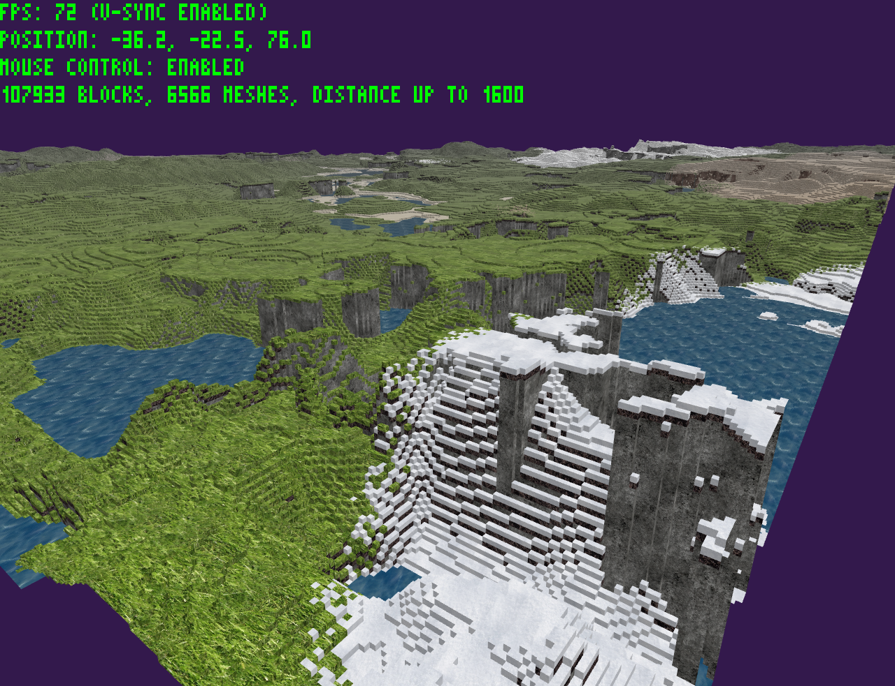

# vCore
A simple voxel renderer

Controls:
* WASD: move
* Shift: down
* Space: up
* J: fast movement (toggle)
* Tab: mouse grab (toggle)
* C: text style (toggle)
* V v-sync (toggle)
* Escape: exit

Dependencies:
* [CMake](https://cmake.org/)
* [fmt](https://fmt.dev/)
* [GLFW](https://glfw.org/)
* [GLM](https://glm.g-truc.net/)
* [SDL2](https://libsdl.org/), SDL2_image
